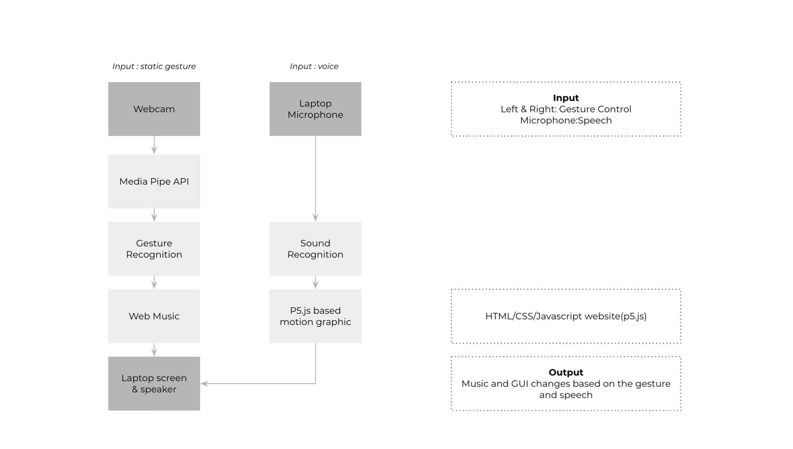

# MediGesture - immersive-meditation with multimodel interaction 
immersive multimodal meditation, a meditation mudras learning &amp; experience tool


> View the lastest version in [your own browser](https://zy-zhu.github.io/MediGesture/)


[](https://zy-zhu.github.io/MediGesture/)

## Abstract 

Immersive Multimodal Meditation(IMM) a multimodal application which enables users to utilize voice and gesture to control the meditation process and customize their  own experience. It is, also, an educational tool which introduces mudras to the one who wants to experience more origin and a fun meditation with the mudras. The interface is created using p5.js, and voice control driven by p5.speech.js, with which users can control the meditation interface with natural language to switch to different modes of the meditation. The hand detection function with a webcam, which enables users to pose mudras, triggers customized chime sounds which aim for a customized meditation experience.

## System Architecture


## Feature 
* supports a sitting-on-the-ground setup with voice commands and camera recognition of customized gestures; 
* offers meditation options which correspond to different visuals and sounds; 
* includes detailed learning instruction to introduce mudras to the meditation beginners or  mudras beginners;
* provides an instructions pop-up on the mudras which can be called and dismissed anytime through gesture;

## IMM uses
* [MediaPipe Hand](https://mediapipe.dev/)
* [p5.js](https://p5js.org/)
* [p5.sound.js](https://p5js.org/reference/#/libraries/p5.sound)
* [p5.speech.js](https://idmnyu.github.io/p5.js-speech/)


## App run 
```python
python -m http.server
```

## Contributors
MediGesture - Immersive Multimodal Meditation is a project by 

[Ziyuan Zhu](https://iam-zy.com/)

[Kat Labrou](https://github.com/babel-kat)
