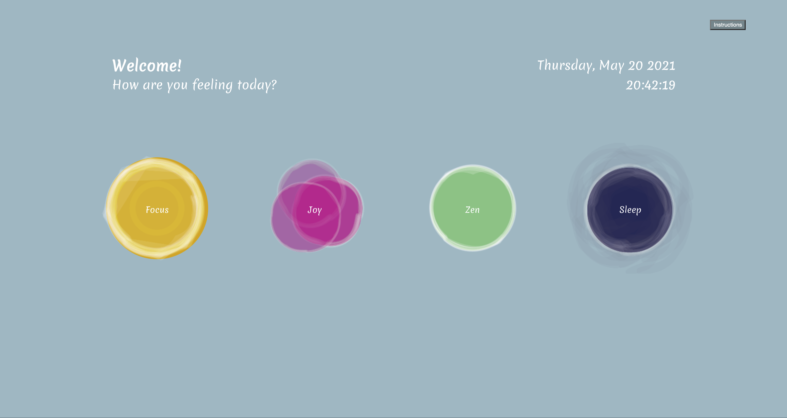

# 6.835-final-project-immersive-meditation
final project for MIT 6.835 immersive multimodal meditation, a meditation mudras learning &amp; experience tool

> View the lastest version in [your own browser](https://zy-zhu.github.io/6.835-final-project-immersive-meditation/)

Immersive Multimodal Meditation(IMM) a multimodal application which enables users to utilize voice and gesture to control the meditation process and customize their  own experience. It is, also, an educational tool which introduces mudras to the one who wants to experience more origin and a fun meditation with the mudras. The interface is created using p5.js, and voice control driven by p5.speech.js, with which users can control the meditation interface with natural language to switch to different modes of the meditation. The hand detection function with a webcam, which enables users to pose mudras, triggers customized chime sounds which aim for a customized meditation experience.

### Contents

index.html  -- 
interface_prototype.js   --  contains all interface design (Pages: Main, Meditation (4 moods), Instructions, End Screen). Also, sound and speech interactions. 

## Contributors
Immersive Multimodal Meditation is a project by [Ziyuan Zhu](https://www.zy-zhu.one/) and [Kat Labrou](https://github.com/babel-kat)
